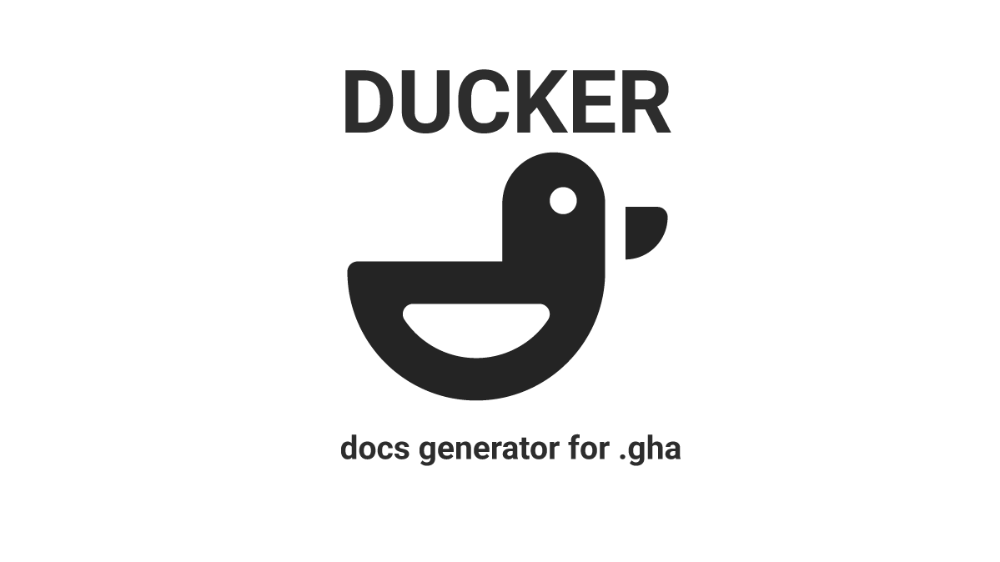

# Ducker
 

_Docs generator for .gha_

## Intro

Ducker is a fast, easy-to-use and hackable documentation generator for Grasshopper assemblies (.gha). You simply feed Ducker with a .gha file, and out comes a styled text document containing the information embedded in the gha file. 

## What is Ducker used for?
Ducker is used for extracting documentation data from .gha files, such as component names, descriptions, icons, inputs and outputs. The extracted documentation can then be published externally (online for instance), so that it can be accessed outside of Grasshopper.

Here's the long version;

Let's say you're developing a [Grasshopper plugin](https://developer.rhino3d.com/guides/grasshopper/your-first-component-windows/). You create a new component by inheriting from the `GH_Component` class, and pass in name, nickname and description arguments to the base constructor:
```csharp
public GH_ReactionForces()
    : base("Reaction Forces", "ReactForce", "View the reaction forces in of model", "Emu", "Analysis") 
{ 
    //...
}
```

Next, you register inputs to the component:
```csharp
protected override void RegisterInputParams(GH_Component.GH_InputParamManager pManager) 
{
    pManager.AddGenericParameter("Finite element Model", "Model", "The FE model to extract the " +
    "reaction forces from.", GH_ParamAccess.item);
}
```

And outputs:
```csharp
protected override void RegisterOutputParams(GH_Component.GH_OutputParamManager pManager) 
{
    pManager.AddPointParameter("Location", "Loc", "Location of the supports.", GH_ParamAccess.list);
    pManager.AddVectorParameter("Forces", "Forc", "Forces", GH_ParamAccess.list);
    pManager.AddVectorParameter("Moments", "Mom", "Moments", GH_ParamAccess.list);
    pManager.AddNumberParameter("Vertical", "Vert", "Sum of vertical reaction forces [N].", GH_ParamAccess.item);
}
```

And finally, you give it a 24x24 png icon:
```csharp
protected override System.Drawing.Bitmap Icon 
{
    get 
    {
        return Emu.Grasshopper.Properties.Resources.GH_SupportReactions;
    }
}
```

Great! Given that you provided sensible names and descriptions to your component, you've created a valuable piece of documentation that will help your users to navigate in using your Grasshopper plugin.

But what if you wanted to make this information available outside of Grasshopper? Maybe you want to give users a glimpse of what the plugin offers, or write a complete reference index of all components included in your plugin. Perhaps in the form of a website (html), a Github readme (markdown) or why not a Word document (.doc)?

It would be a bummer having to copy or write all those carefully crafted sentences from you GH plugin again in a separate text file. And what if you discover and fix a typo - then you would have to fix the typo twice!

This is where Ducker can help! Using Ducker, you can extract this information and automatically export it into a text file.

## Example output
Below is an example of using the `StandardMdDocGenerator` exporter. You can see the full example [here](https://github.com/EmilPoulsen/Emu.Resources/tree/master/reference).

**Name:** Reaction Forces  
**NickName:** ReactForce  
**Description:** View the reaction forces in of model  

### Input
| Name | NickName | Description |
| ------ | ------ | ------ |
| Finite element Model | Model | The FE model to extract the reaction forces from. |
### Output
| Name | NickName | Description |
| ------ | ------ | ------ |
| Location | Loc | Location of the supports. |
| Forces | Forc | Forces |
| Moments | Mom | Moments |
| Vertical | Vert | Sum of vertical reaction forces [N]. |

## How can can I use Ducker?
Easiest way to use Ducker is to download the latest release. **Please note that it requires Rhino 7 and Windows .NET Framework 4.8 installed to run.** Follow these instructions:
- Download the latest release from [here](https://github.com/EmilPoulsen/Ducker/releases). Choose the zip file matching the pattern `ducker-X.X.X.zip`.
- Unblock the zip
- Unzip the file
- Double click on the Ducker.exe file.
- Select the .gha file you want to extract docs from.
- Hit the "Run button."
- The output will be placed in a folder named "ducker" next to the selected gha file.

Alternatively, you can clone the repo and build the project yourself using Visual Studio 2022. `Ducker.UI` is the executible WPF application tha you see in the demo below.

**IMPORTANT NOTE:** Ducker is in beta, meaning the code most likely contain errors and bugs. If you come across any odd behavior, please report it by creating a [new issue](https://github.com/EmilPoulsen/Ducker/issues) in this repository.

## Demo


_Quick and dirty example of how to extract documentation of a Grasshopper plugin using Ducker._

## Who is Ducker for?
Ducker us useful for Grasshopper plugin developers who don't want to write the same documentation twice.

## How does Ducker work?
Ducker uses a combination of reflection and Rhino.Inside to open and extract the contents of the GHA. This means that Rhino 7 must be installed on the machine it runs on for it to work.

## Contribute
Contributions are very much welcome! Some spontaneous ideas about entry points:
- More output formats, for instance html and word docs.
- Refine the UI. Perhaps ditch WPF to make it runnable on mac.
- Console app implementation, so that it can be integrated in CI/CD pipelines.

## Create your own output formats
The current version of Ducker only comes with a built in markdown exporter, but you can easily create your own formats and document generators by implementing the `IDocGenerator` interface:

```csharp
/// <summary>
/// Interface for objects that turns ducker components to a readable document.
/// </summary>
public interface IDocGenerator
{
    /// <summary>
    /// Creates the contents of the document based on components and the export settings
    /// </summary>
    /// <param name="components">The components included in the gha.</param>
    /// <param name="settings">The output settings.</param>
    /// <returns>Content of the document.</returns>
    DocumentContent Create(List<DuckerComponent> components, ExportSettings settings);

    /// <summary>
    /// File extension of the output file. For instance txt or md.
    /// </summary>
    string FileExtension { get; }
}
```

Check out the [`MarkDownDocGenerator`](https://github.com/EmilPoulsen/Ducker/blob/master/Ducker.Core/Generate/MarkDownDocGenerator.cs) to see an example of how this interface can be implemented.

## License
[MIT](/LICENSE)

## Support Ducker
Do you find Ducker useful? [Buy me a coffe](https://www.buymeacoffee.com/2SRF6X1V6S)! :)
